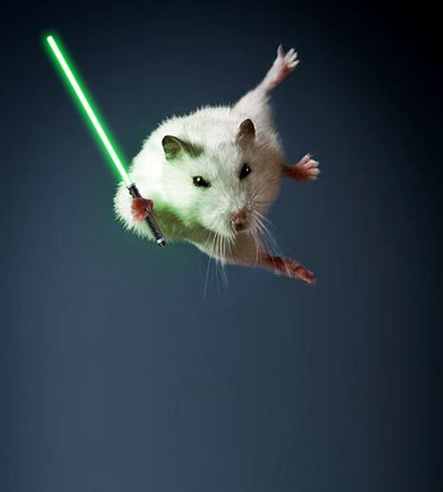
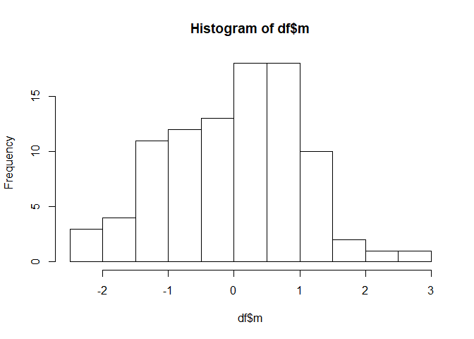
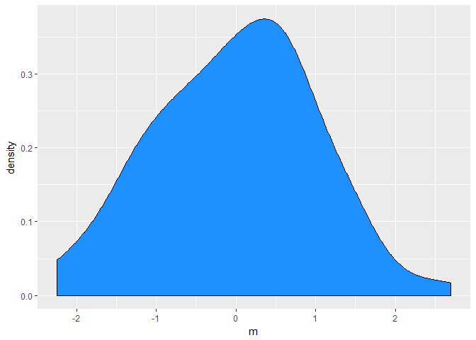
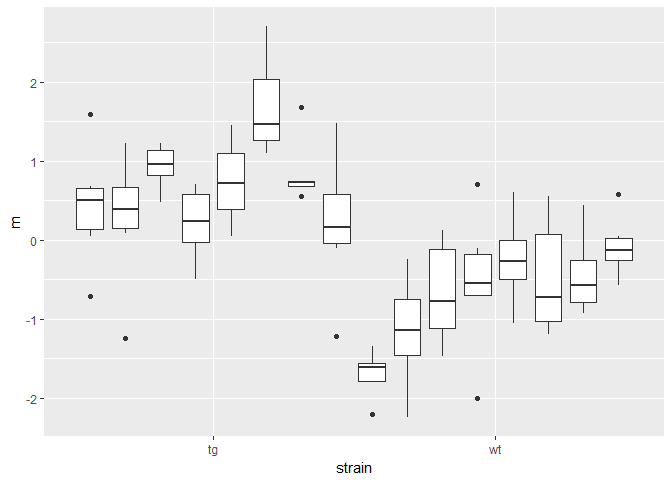
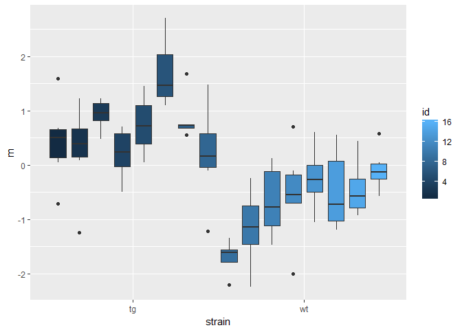
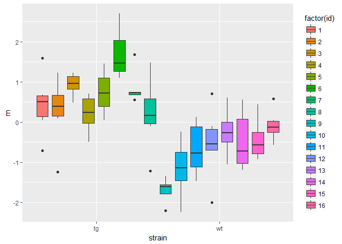
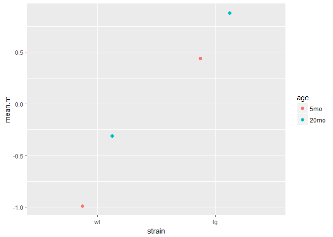
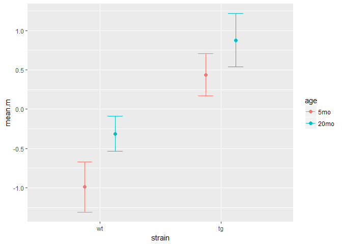
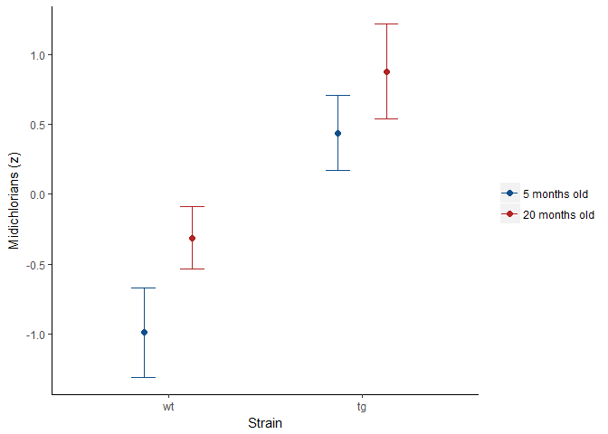

*2. Working with data*
================
Bindoff, A.

2018-06-08

This tutorial aims to teach some good data organisation practices, then how to load and summarise the data in R. But first, we need to be able to install a few helpful packages which make working with data in R easier and more efficient.

#### 2.1 Installing packages

R is an open source language which means that anyone can contribute a package to R. A package is a collection of related functions written in R (or in other languages, but that can be called from R). Most of these packages are available from the "CRAN" repository (these undergo some fairly rigorous testing first), and R Studio will install and manage packages from the CRAN repository for you. You can install packages by clicking on Tools -&gt; Install Packages. Once you start typing the name of the package R Studio will try to guess which package you would like to install. Use R Studio to install "dplyr" now.

Alternatively, you can install packages by typing "install.packages("packageName")" in the console. Note that "packageName" is case-sensitive and needs to be enclosed in single or double quotes. By default, R will also install any packages that the package you are installing requires.

Please install the following packages which we will be using in this tutorial: dplyr ggplot2

#### 2.2 Loading packages

The function `library(packageName)` will load a package into the environment so that its functions can be used. Note that the package name is case sensitive and is **not** quoted. We will load `dplyr` and `ggplot2`

``` r
library(dplyr)
```

    ## 
    ## Attaching package: 'dplyr'

    ## The following objects are masked from 'package:stats':
    ## 
    ##     filter, lag

    ## The following objects are masked from 'package:base':
    ## 
    ##     intersect, setdiff, setequal, union

``` r
library(ggplot2)
```

#### 2.3 Good practice in data organisation

There are endless ways we can organise our data, but for most statistical applications data needs to be represented in **flat tables**. Flat tables have the same number of rows for each column and the same number of columns for each row. Data organisation falls into two broad categories:
- long format
- wide format

Wide format has a row for each subject and a column for each variable. Long format has multiple rows per subject and (usually) fewer columns. Lab scientists tend to prefer to record their data in wide format, but sometimes the data needs to be analysed in long format. Don't worry too much about the distinction, but do store your data in a format that has the same number of rows for each column and the same number of columns for each row. The `reshape2` package makes converting between long format and wide format data easy in most cases.

In the next part of this tutorial we will load some long format data. But first, ensure that you have the data file "midichlorians.csv" in your working directory. You can either type the command `getwd()` in your console and move the file to that directory, or go to Session -&gt; Set Working Directory and change the working directory.

#### 2.4 Loading a .csv file into R

We will use the function `read.csv()` to load the file "midichlorians.csv" and store it in a data frame called `df`

``` r
df <- read.csv("midichlorians.csv")
df$age <- factor(df$age, labels = c("5mo", "20mo")) # make t a factor with sensible labels
```

The data are from an experiment that took transgenic and wild-type mice and subjected them to twice-weekly Jedi training. Mice were euthanased at 5 months and 20 months of age, and their midichlorians counted. The counts were standardized to z-scores by deducting the mean from each score and dividing by the standard deviation for the sample.



*(This one's midichlorians were over 20000!)*

In order to view the entire data frame we can use the function `View(df)` in the console. If we just want to see a few rows we can use `head(df)`

``` r
head(df)
```

    ##   id strain  age           m
    ## 1  6     tg 20mo  1.09990148
    ## 2  6     tg 20mo  2.22028338
    ## 3 13     wt 20mo  0.02081187
    ## 4  5     tg 20mo  1.45717150
    ## 5  1     tg  5mo  0.05020651
    ## 6  4     tg  5mo -0.50045327

#### 2.5 Looking at your data

`xtabs()` takes a formula that includes the variables of interest, then counts the number of observations in each cell. `table()` is very similar, it will count the number of observations at each level of a factor. To see what other arguments xtabs will take, type `? xtabs` in the console, output will appear in the bottom right pane under the Help tab.

``` r
xtabs(~strain + age, df)
```

    ##       age
    ## strain 5mo 20mo
    ##     tg  23   23
    ##     wt  23   24

``` r
table(df$strain)
```

    ## 
    ## tg wt 
    ## 46 47

By far the best way to look at your data is to plot it. Let's check to see if `m` is normally distributed.

``` r
hist(df$m)
```



Alternatively, we can use the `ggplot` function from the `ggplot2` library to obtain a density curve

``` r
ggplot(df, aes(x = m)) +
  geom_density(fill = "dodgerblue")
```



`ggplot` is a very powerful graphics library for data visualisation. The "gg" part of the name stands for "grammar of graphics", and reflects the "verbal" properties of its functions. It is exceptionally well documented on-line, and I would recommend the free "R Graphics Cookbook" or "tidyverse" online documentation as excellent resources.

Let's produce an informative plot, part by part:

``` r
p <- ggplot(data = df, aes(x = strain, y = m, group = id))
```

The first argument tells ggplot where the data can be found. The `aes` argument define the 'aesthetics' for the plot (what it is supposed to represent). At the moment the plot is stored as an object `p` which doesn't have any elements except for an x and y axis (type p into your console to check).

``` r
p + geom_boxplot(position = position_dodge(width = 1))
```



This is reasonably informative. It shows us the median and quantiles for each mouse, and the dots show us observations that may be outliers (more than 2 SD from the mean). A bit of colour might help to identify animals -

``` r
p + geom_boxplot(position = position_dodge(width = 1), aes(fill = id))
```



This is an improvement, but something is not right. Mouse id seems to be on a scale. Perhaps R doesn't recognise it as a factor representing individuals?

``` r
p + geom_boxplot(position = position_dodge(width = 1), aes(fill = factor(id)))
```



Alternatively, we could change the data frame (and while we're at it, re-order 'wt' as the baseline). This is certainly good practice, because it means we won't keep repeating the mistake when making new plots or analysing the data.

``` r
df$id <- factor(df$id)
df$strain <- factor(df$strain, levels = c("wt", "tg"))

ggplot(data = df, aes(x = strain, y = m, group = id, fill = id)) +
     geom_boxplot(position = position_dodge(width = 1))
```


#### 2.6 Summarising your data

Having checked our data for extreme outliers and potential issues, we might want to zoom out a bit

``` r
ggplot(df, aes(x = strain, y = m, fill = age)) +
  geom_violin(draw_quantiles = c(0.5))
```


This is a good exploratory plot because it shows the *density* of m conditioned on `strain` and time `t`, but it might not be the most familiar way to present the data in a publication, and we would typically want to know the mean and a confidence interval. The `dplyr` package offers useful functions for arranging and looking at our data.

``` r
df0 <- group_by(df, strain, age) %>%
  summarise(mean.m = mean(m), se.m = sd(m)/sqrt(sum(!is.na(m))))
df0
```

    ## # A tibble: 4 x 4
    ## # Groups:   strain [?]
    ##   strain age   mean.m  se.m
    ##   <fct>  <fct>  <dbl> <dbl>
    ## 1 wt     5mo   -0.988 0.164
    ## 2 wt     20mo  -0.312 0.113
    ## 3 tg     5mo    0.437 0.137
    ## 4 tg     20mo   0.876 0.173

The first function, `group_by()` takes a data frame, then groups rows by `strain` then by `t`. `%>%` is called the "pipe operator" and it carries data from the previous operation through to the next operation. `summarise()` applies a function or functions to data. So in this case, we've given it grouped data to summarise.

`mean()` calculates a mean, and `sd()` calculates the standard deviation. We've divided the standard deviation by the square root of *n* to find the **standard error of the mean** *(!is.na(m) gives a vector of TRUE/FALSE evaluations, where TRUE = 1 and FALSE = 0, so summing the elements of this vector is a clever way to count the number of observations while ignoring missing data)*. Because R was developed by statisticians, a base function to calculate the standard error of the mean was considered unnecessary, but fortunately there are several packages that will do this for you. I recommend installing the `plotrix` library and using the `std.error()` function.

``` r
p <- ggplot(df0, aes(x = strain, y = mean.m, colour = age)) +
  geom_point(size = 2, position = position_dodge(width = 0.5))
p
```



``` r
p <- p + geom_errorbar(aes(min = mean.m - 1.96*se.m, max = mean.m + 1.96*se.m),
                  position = position_dodge(width = 0.5), width = 0.25)
p
```



This is starting to look good, the whiskers show 95% CIs (mean ±1.96SEM), and all experimental conditions are shown. A little more work makes it publication ready.

``` r
p + scale_colour_manual(values = c("dodgerblue4", "firebrick"),
                        name = element_blank(),
                        labels = c("5 months old", "20 months old")) +
  theme(panel.grid.major = element_blank(),
        panel.grid.minor = element_blank(),
        panel.background = element_blank(),
        axis.line = element_line(colour = "black")) +
  labs(y = "Midichlorians (z)", x = "Strain")
```



*Continue to tutorial 3,* [Estimation using Mixed Models](https://github.com/ABindoff/R_tutorials/blob/master/3_Estimation.md)

### Resources

[R Graphics Cookbook](http://www.cookbook-r.com/Graphs/)
[Efficient R Programming (e-book)](https://csgillespie.github.io/efficientR/index.html)
