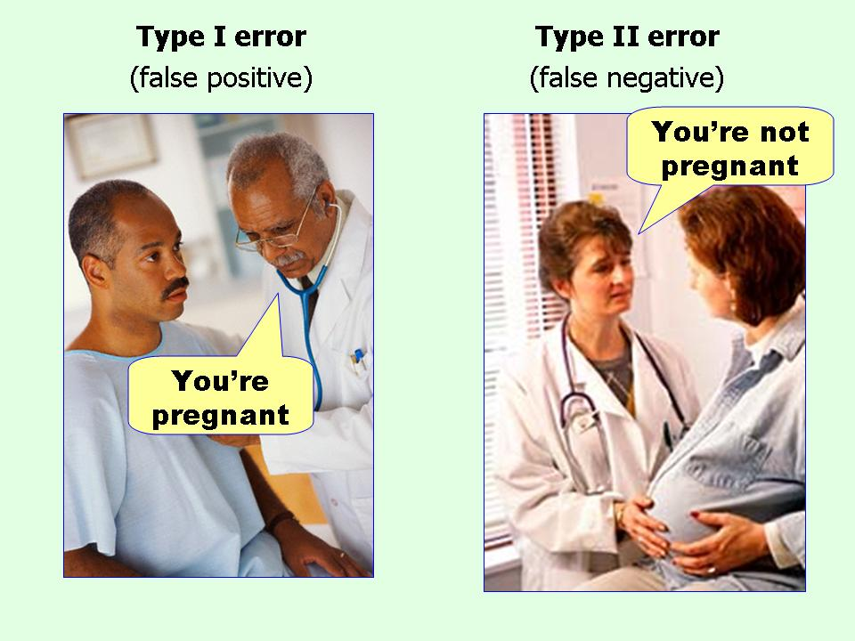

*3. Estimation using mixed models*
================
Bindoff, A.

2018-04-26

In the previous tutorial we looked at some ways to summarise data in tables and figures using the `dplyr` and `ggplot2` packages in R. If you are already working with data of your own you may have already plotted your data and started to make some interpretation. But how do we know what is the real effect of a treatment or observed variable, and what is just chance occurrence? For it is certainly true that random noise will produce patterns, and conversely, that sytematic patterns can be lost in noise. This is why it is useful to [both plot and analyse data](https://www.autodeskresearch.com/publications/samestats). In this tutorial we will explore some ways to analyse data from **laboratory experiments**.

For this tutorial we will assume that you have some background in experimental design (for nothing will save a poorly designed experiment). We will not assume that things don't go wrong, that there won't be any measurement error, or that there are not factors outside of your control. A recurring theme throughout this tutorial will be minimisation of Type I and Type II errors. This is not merely the pursuit of scientific or statistical purity, but so that you avoid wasting years of your life trying to replicate something that was never there, or potentially missing the next big discovery!



### Models

In some disciplines, data analysis and statistics is taught from a hypothesis testing perspective, where you learn which test to apply when in order to obtain a p-value. It is important to realise that this is a test of how *surprising* the data would be if there were no effect. If your statistical model is poorly fitted, only the largest effects will be "surprising" because you aren't accounting for the variance you might reasonably expect to see due to known and measurable factors.

A good experiment analysed with a poorly fitted model is more likely to produce Type II errors, and an experiment analysed with a model that makes unreasonable assumptions about the generalisability of the experiment is more likely to produce Type I errors or models that only work for the sample (but generalise poorly to the population).

We will begin with a problematic example with features that will be familiar to many lab scientists. In this experiment, there are clearly systematic sources of variance that are outside of the experimenter's control. We will simulate results from a mouse embryo experiment assessing the effect of two levels of a drug (plus a control) on cell cultures. Experimental treatments were applied over two days, and the level of protein expressed recorded after treatment.

``` r
set.seed(123)
day <- c(rep(1, 20), rep(2, 20), rep(3, 15))  # 20 observations on day 1, 20 observations on day 2, 15 observations on day 3
treatment <- c(rep(0, 15),
               rep(10, 5),
               rep(0, 10),
               rep(12, 10),
               rep(0, 5),
               rep(10, 5),
               rep(12, 5))  # 20 controls, 20 at level 10mg, 15 at level 12mg
day.effect <- c(rnorm(20, 0, 2), rnorm(20, 5, 2), rnorm(15, 2, 2))  # random effect of day
protein <- 5 + 0.23*treatment + day.effect + rnorm(55, 0, .9)
df <- data.frame(day = factor(day), treatment = factor(treatment), protein)
```

Inspection of boxplots and linear regression suggests no effect of 10mg treatment.

``` r
ggplot(df, aes(x = treatment, y = protein)) +
  geom_boxplot()
```


``` r
summary(lm(protein ~ treatment, df))
```

    ## 
    ## Call:
    ## lm(formula = protein ~ treatment, data = df)
    ## 
    ## Residuals:
    ##     Min      1Q  Median      3Q     Max 
    ## -4.8996 -1.6082  0.3815  1.6491  5.2396 
    ## 
    ## Coefficients:
    ##             Estimate Std. Error t value Pr(>|t|)    
    ## (Intercept)   7.0696     0.4443  15.912  < 2e-16 ***
    ## treatment10   0.6134     0.8886   0.690    0.493    
    ## treatment12   5.4909     0.7695   7.135 3.01e-09 ***
    ## ---
    ## Signif. codes:  0 '***' 0.001 '**' 0.01 '*' 0.05 '.' 0.1 ' ' 1
    ## 
    ## Residual standard error: 2.434 on 52 degrees of freedom
    ## Multiple R-squared:  0.5046, Adjusted R-squared:  0.4855 
    ## F-statistic: 26.48 on 2 and 52 DF,  p-value: 1.174e-08

Conditioning on `day` reveals a layer of the story, and suggests that the null result (previous) for 10mg is a Type I error.

``` r
ggplot(df, aes(x = treatment, y = protein, colour = day)) +
  geom_boxplot()
```


``` r
summary(lm(protein ~ treatment + day, df))
```

    ## 
    ## Call:
    ## lm(formula = protein ~ treatment + day, data = df)
    ## 
    ## Residuals:
    ##     Min      1Q  Median      3Q     Max 
    ## -3.2667 -1.1442 -0.1842  1.2446  4.1841 
    ## 
    ## Coefficients:
    ##             Estimate Std. Error t value Pr(>|t|)    
    ## (Intercept)   5.4367     0.4565  11.911 3.25e-16 ***
    ## treatment10   1.4937     0.7217   2.070   0.0437 *  
    ## treatment12   3.8581     0.6654   5.798 4.50e-07 ***
    ## day2          4.1460     0.6847   6.055 1.79e-07 ***
    ## day3          1.5050     0.6847   2.198   0.0326 *  
    ## ---
    ## Signif. codes:  0 '***' 0.001 '**' 0.01 '*' 0.05 '.' 0.1 ' ' 1
    ## 
    ## Residual standard error: 1.875 on 50 degrees of freedom
    ## Multiple R-squared:  0.7172, Adjusted R-squared:  0.6945 
    ## F-statistic:  31.7 on 4 and 50 DF,  p-value: 3.674e-13

It is usual to see these large effects of day (or batch, or new bottle of vehicle, or animal...) confounding the effect of treatment, but there's not much we can infer from this experiment because we don't know what it *was about `day`* that made the difference. Hence, we call `day` a "random effect" to distinguish it from a "fixed effect". `Day` is not something we can manipulate or assign some fixed value by which an adjustment can be made to predict the effect of any particular `day` *in future experiments* or *in the population*.

One solution is to center the response variable by deducting the mean `protein` for each day from each observation on that day.

``` r
df <- group_by(df, day) %>% mutate(protein_c = scale(protein, scale = F)) 
    # mutate produces a new column using a function which you specify
ggplot(df, aes(x = treatment, y = protein_c, colour = day)) +
  geom_boxplot()
```


``` r
summary(m1 <- lm(protein_c ~ treatment, df))
```

    ## 
    ## Call:
    ## lm(formula = protein_c ~ treatment, data = df)
    ## 
    ## Residuals:
    ##     Min      1Q  Median      3Q     Max 
    ## -3.7529 -1.6384 -0.2656  1.3874  4.2067 
    ## 
    ## Coefficients:
    ##             Estimate Std. Error t value Pr(>|t|)    
    ## (Intercept)  -1.1271     0.3562  -3.164   0.0026 ** 
    ## treatment10   1.5421     0.7124   2.165   0.0350 *  
    ## treatment12   3.1045     0.6170   5.032 6.16e-06 ***
    ## ---
    ## Signif. codes:  0 '***' 0.001 '**' 0.01 '*' 0.05 '.' 0.1 ' ' 1
    ## 
    ## Residual standard error: 1.951 on 52 degrees of freedom
    ## Multiple R-squared:  0.3322, Adjusted R-squared:  0.3065 
    ## F-statistic: 12.94 on 2 and 52 DF,  p-value: 2.756e-05

This approach has the benefit of removing the mean effect of day. But what if (as in this case, but to a greater extreme) treatments aren't balanced over days? What if there is more than one random effect? What if the random effect has a different effect on the control group than on treatment groups?

### Mixed Models

Fortunately, **linear mixed models** allow us to account for random effects by modelling them under the assumption that the random effects are drawn from a normal distribution, which can be estimated by finding the mean and variance. Compare the results from the mixed model below with the adjusted data above.

``` r
summary(m <- lmer(protein ~ treatment + (1|day), df))
```

    ## Linear mixed model fit by REML t-tests use Satterthwaite approximations
    ##   to degrees of freedom [lmerMod]
    ## Formula: protein ~ treatment + (1 | day)
    ##    Data: df
    ## 
    ## REML criterion at convergence: 227.2
    ## 
    ## Scaled residuals: 
    ##      Min       1Q   Median       3Q      Max 
    ## -1.78853 -0.59872 -0.07534  0.62811  2.22781 
    ## 
    ## Random effects:
    ##  Groups   Name        Variance Std.Dev.
    ##  day      (Intercept) 4.171    2.042   
    ##  Residual             3.516    1.875   
    ## Number of obs: 55, groups:  day, 3
    ## 
    ## Fixed effects:
    ##             Estimate Std. Error      df t value Pr(>|t|)    
    ## (Intercept)   7.3070     1.2328  2.1403   5.927   0.0232 *  
    ## treatment10   1.4469     0.7198 50.5028   2.010   0.0498 *  
    ## treatment12   3.9450     0.6617 50.9665   5.962 2.36e-07 ***
    ## ---
    ## Signif. codes:  0 '***' 0.001 '**' 0.01 '*' 0.05 '.' 0.1 ' ' 1
    ## 
    ## Correlation of Fixed Effects:
    ##             (Intr) trtm10
    ## treatment10 -0.146       
    ## treatment12 -0.174  0.220

We can even assess the accuracy of these random effects against the simulated values:

``` r
ranef(m)
```

    ## $day
    ##   (Intercept)
    ## 1  -1.7834305
    ## 2   2.1419826
    ## 3  -0.3585521

``` r
df$day.effect <- day.effect
k <- group_by(df, day) %>% summarise(day.effect = mean(day.effect))
scale(k$day.effect, scale = F)[,1]
```

    ## [1] -2.1653336  2.4489045 -0.2835709

Can we now confidently state that there is a treatment effect? (Hint: not without more information)

The issue here is that each observation has been treated as a replicate. We don't know if the sample is representative of the population, and thus, whether the observed effect will generalise to the population. As it turns out, this experiment took cells from just two embryos (labelled `a` and `b` below).

``` r
df$embryo <- c(rep("a", 20), rep("b", 20), rep("a", 15))

ggplot(df, aes(x = treatment, y = protein, colour = embryo)) +
  geom_boxplot() +
  facet_wrap(~ day)
```


In a mixed model we can estimate the random effect of `day` and `embryo` in the same model. This allows us to relax the *assumption of independence of residuals*.

``` r
summary(m2 <- lmer(protein ~ treatment + (1|day) + (1|embryo), df))
```

    ## Linear mixed model fit by REML t-tests use Satterthwaite approximations
    ##   to degrees of freedom [lmerMod]
    ## Formula: protein ~ treatment + (1 | day) + (1 | embryo)
    ##    Data: df
    ## 
    ## REML criterion at convergence: 226.4
    ## 
    ## Scaled residuals: 
    ##     Min      1Q  Median      3Q     Max 
    ## -1.8160 -0.5541 -0.0720  0.6315  2.3238 
    ## 
    ## Random effects:
    ##  Groups   Name        Variance Std.Dev.
    ##  day      (Intercept) 0.8981   0.9477  
    ##  embryo   (Intercept) 4.9087   2.2156  
    ##  Residual             3.5159   1.8751  
    ## Number of obs: 55, groups:  day, 3; embryo, 2
    ## 
    ## Fixed effects:
    ##             Estimate Std. Error      df t value Pr(>|t|)    
    ## (Intercept)   7.7506     1.7092  1.0247   4.535   0.1337    
    ## treatment10   1.5111     0.7190 50.6770   2.102   0.0406 *  
    ## treatment12   3.9965     0.6563 51.1832   6.089 1.47e-07 ***
    ## ---
    ## Signif. codes:  0 '***' 0.001 '**' 0.01 '*' 0.05 '.' 0.1 ' ' 1
    ## 
    ## Correlation of Fixed Effects:
    ##             (Intr) trtm10
    ## treatment10 -0.090       
    ## treatment12 -0.138  0.212

Can we confidently state that there is an effect of treatment? Yes, but with the caveat that everything we know about the effect of treatment from this experiment is based on observations on cells from just two embryos.

### Clustering

Another way to think about random effects are as grouping or *clustering* variables. Above we obtained a very reasonable result by simply deducting daily mean `protein` from observations for the corresponding day. In effect, this is a crude but reasonable way to account for the effect of clustering on day. Similarly, if dealing with multiple observations from each subject, in order to satisfy the *assumption of independence* it is reasonable to reduce the observations per subject to a mean, or deduct pre-test scores from post-test scores in some repeated measures experiments. Doing this comes at the expense of information about how much the observations within each subject vary.

The assumption of independence can be relaxed by including random effects terms in the model to specify where (and how) the data are clustered. For example, in a repeated measures experiment, a random intercept can be fitted for each subject. This is the mean of all scores for each subject. A more complicated random effects structure might also fit a random slope for each subject, accounting for the average change in scores for each subject. [This paper](https://www.ncbi.nlm.nih.gov/pubmed/24403724) provides an excellent overview of random effects structures.

In the next example we simulate data from a simple within-subjects behavioural experiment where mice have been trained to perform a task and are then tested again after a treatment. Four observations are taken from each animal at each time point.

``` r
set.seed(123)
id <- rep(c(1:10), 8)
time <- c(rep(0, 40), rep(1, 40))
id_int_effect <- rep(rnorm(10, 0, 2), 8)
id_slope_effect <- rep(rnorm(10, 0.25, 0.25), 8)
accuracy <- time*id_slope_effect + id_int_effect + rnorm(80, 0, 0.5)
df <- data.frame(id = factor(id), time = factor(time), accuracy)

df0 <- group_by(df, id, time) %>% summarise(accuracy = mean(accuracy))

ggplot(df0, aes(x = time, y = accuracy, group = id, colour = id)) +
  geom_line() +
  geom_point(aes(x = time, y = accuracy, colour = id), data = df)
```


The different coloured lines show the mean change between pre-treatment (t = 0) and post-treatment (t = 1) scores. It is clear that animals who have a low score at t = 0 tend to have a low score at t = 1. There is a trend towards higher scores at t = 1, but the effect is stronger for some than for others.

For our first analysis we will ignore the random effect (and assumption of independence)

``` r
summary(m1 <- lm(accuracy ~ time, df))
```

    ## 
    ## Call:
    ## lm(formula = accuracy ~ time, data = df)
    ## 
    ## Residuals:
    ##    Min     1Q Median     3Q    Max 
    ## -3.897 -1.265 -0.447  1.042  4.124 
    ## 
    ## Coefficients:
    ##             Estimate Std. Error t value Pr(>|t|)
    ## (Intercept)   0.1631     0.3093   0.527    0.600
    ## time1         0.3521     0.4374   0.805    0.423
    ## 
    ## Residual standard error: 1.956 on 78 degrees of freedom
    ## Multiple R-squared:  0.008241,   Adjusted R-squared:  -0.004473 
    ## F-statistic: 0.6482 on 1 and 78 DF,  p-value: 0.4232

We know that even though there is a lot of noise (the `rnorm` arguments add random noise to the intercept and slope), there is a real effect (because we simulated it), but this is not reflected in the p-value. Next we will account for the observed trend that animals with higher accuracy scores at t = 0 tend to have higher accuracy scores at t = 1.

``` r
summary(m2 <- lmer(accuracy ~ time + (1|id), df))
```

    ## Linear mixed model fit by REML t-tests use Satterthwaite approximations
    ##   to degrees of freedom [lmerMod]
    ## Formula: accuracy ~ time + (1 | id)
    ##    Data: df
    ## 
    ## REML criterion at convergence: 164
    ## 
    ## Scaled residuals: 
    ##      Min       1Q   Median       3Q      Max 
    ## -2.03341 -0.63480  0.08234  0.68433  1.99811 
    ## 
    ## Random effects:
    ##  Groups   Name        Variance Std.Dev.
    ##  id       (Intercept) 3.8744   1.9684  
    ##  Residual             0.2499   0.4999  
    ## Number of obs: 80, groups:  id, 10
    ## 
    ## Fixed effects:
    ##             Estimate Std. Error      df t value Pr(>|t|)   
    ## (Intercept)   0.1631     0.6274  9.1444   0.260  0.80072   
    ## time1         0.3521     0.1118 68.9999   3.151  0.00241 **
    ## ---
    ## Signif. codes:  0 '***' 0.001 '**' 0.01 '*' 0.05 '.' 0.1 ' ' 1
    ## 
    ## Correlation of Fixed Effects:
    ##       (Intr)
    ## time1 -0.089

We have 10 animals, so while this analysis is valid, an estimated denominator degrees of freedom of 69 seems high. Recall that the p-value is calculated using some statistic (*e.g* F in ANOVA) with **degrees of freedom**. If the df seems too high, this suggests the possibility of an inflated Type I error rate.

Next we estimate a random slope (plus random intercept) in our random effects structure.

``` r
summary(m3 <- lmer(accuracy ~ time + (time|id), df))
```

    ## Linear mixed model fit by REML t-tests use Satterthwaite approximations
    ##   to degrees of freedom [lmerMod]
    ## Formula: accuracy ~ time + (time | id)
    ##    Data: df
    ## 
    ## REML criterion at convergence: 159.6
    ## 
    ## Scaled residuals: 
    ##      Min       1Q   Median       3Q      Max 
    ## -2.00723 -0.64713 -0.01132  0.67274  1.88171 
    ## 
    ## Random effects:
    ##  Groups   Name        Variance Std.Dev. Corr
    ##  id       (Intercept) 3.4653   1.8615       
    ##           time1       0.1076   0.3280   0.63
    ##  Residual             0.2218   0.4709       
    ## Number of obs: 80, groups:  id, 10
    ## 
    ## Fixed effects:
    ##             Estimate Std. Error     df t value Pr(>|t|)  
    ## (Intercept)   0.1631     0.5934 9.0000   0.275   0.7897  
    ## time1         0.3521     0.1478 9.0000   2.382   0.0411 *
    ## ---
    ## Signif. codes:  0 '***' 0.001 '**' 0.01 '*' 0.05 '.' 0.1 ' ' 1
    ## 
    ## Correlation of Fixed Effects:
    ##       (Intr)
    ## time1 0.377

The p-value is now estimated using df = 9 which seems far more appropriate given that only 10 animals were studied. The estimated variance for the random slope is non-zero (which we know is true anyway because we simulated these data), which suggests that this term should be included. A likelihood ratio test and AIC statistics show that both models are equivalent, leaving the choice of models up to the analyst.

``` r
anova(m2, m3)
```

    ## refitting model(s) with ML (instead of REML)

    ## Data: df
    ## Models:
    ## object: accuracy ~ time + (1 | id)
    ## ..1: accuracy ~ time + (time | id)
    ##        Df    AIC    BIC  logLik deviance Chisq Chi Df Pr(>Chisq)
    ## object  4 170.31 179.83 -81.153   162.31                        
    ## ..1     6 170.13 184.43 -79.066   158.13 4.173      2     0.1241

The benefit of the random slope term is that it reduces the influence of more extreme data (e.g single animals who respond more strongly than average) by adjusting for the influence of the extreme data.

While there is a strong incentive to find small p-values [(and this may be a selection pressure in the scientific community)](http://rsos.royalsocietypublishing.org/content/3/9/160384), inflated Type I error rates lead to false conclusions. What do we mean by "inflated Type I error rates"? If we accept p = .05 as a cut-off, we're really saying that we're prepared to accept a Type I error .05 (or 5%) of the time - which is a reasonable proposition. However, if our p-values don't approximate the probability of observing the result (or a more extreme result) due to chance, then we may be accepting a much higher Type I error rate. By letting extreme values influence the result, we are implying that we believe our sample to be representative of the population, and accepting the obtained p-value on this basis. If it's not true that our sample is representative of the population then the p-value will not represent the probability of obtaining the observed result (or more extreme) by chance.

In order to throw a little fat on the fire, let's compute the same regression using the mean values for each animal at each time point (`df0` is the data frame we used to produce the mean slopes in the plot above).

``` r
summary(m4 <- lmer(accuracy ~ time + (1|id), df0))
```

    ## Linear mixed model fit by REML t-tests use Satterthwaite approximations
    ##   to degrees of freedom [lmerMod]
    ## Formula: accuracy ~ time + (1 | id)
    ##    Data: df0
    ## 
    ## REML criterion at convergence: 54.3
    ## 
    ## Scaled residuals: 
    ##      Min       1Q   Median       3Q      Max 
    ## -1.13068 -0.69316 -0.04124  0.63856  1.13611 
    ## 
    ## Random effects:
    ##  Groups   Name        Variance Std.Dev.
    ##  id       (Intercept) 3.8510   1.9624  
    ##  Residual             0.1092   0.3305  
    ## Number of obs: 20, groups:  id, 10
    ## 
    ## Fixed effects:
    ##             Estimate Std. Error     df t value Pr(>|t|)  
    ## (Intercept)   0.1631     0.6293 9.2517   0.259   0.8012  
    ## time1         0.3521     0.1478 9.0000   2.382   0.0411 *
    ## ---
    ## Signif. codes:  0 '***' 0.001 '**' 0.01 '*' 0.05 '.' 0.1 ' ' 1
    ## 
    ## Correlation of Fixed Effects:
    ##       (Intr)
    ## time1 -0.117

Compare the *β* coefficients ("Estimate" column in model summaries) and p-values for time1 for each model, *m*<sub>1</sub>, *m*<sub>2</sub>, *m*<sub>3</sub>, *m*<sub>4</sub>. The *β* coefficients should be identical, and the p-values for *m*<sub>3</sub> and *m*<sub>4</sub> should also be the same. This is *not* to imply that summarising the mean of observations at each time point for each animal and regressing on those will always be equivalent to a random intercept + random slope model. This example serves two purposes, 1. to show that a random intercept + random slope model correctly estimates the mean response for each animal (under the assumption of normality of residuals), and 2. to get you thinking about (and perhaps discussing) when this might not be the case, and where mixed models might offer a unique advantage.

*Continue to tutorial 4,* [When the data aren't normal](https://github.com/ABindoff/R_tutorials/blob/master/4_counts_and_proportions.md)

### Resources

[R Graphics Cookbook](http://www.cookbook-r.com/Graphs/)
[Random effects structure for confirmatory hypothesis testing: Keep it maximal](https://www.ncbi.nlm.nih.gov/pubmed/24403724)
