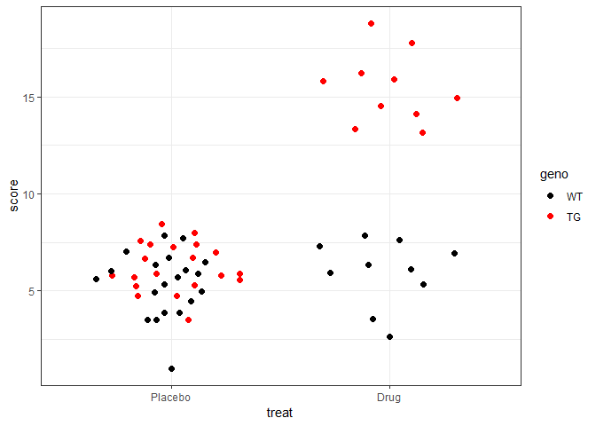
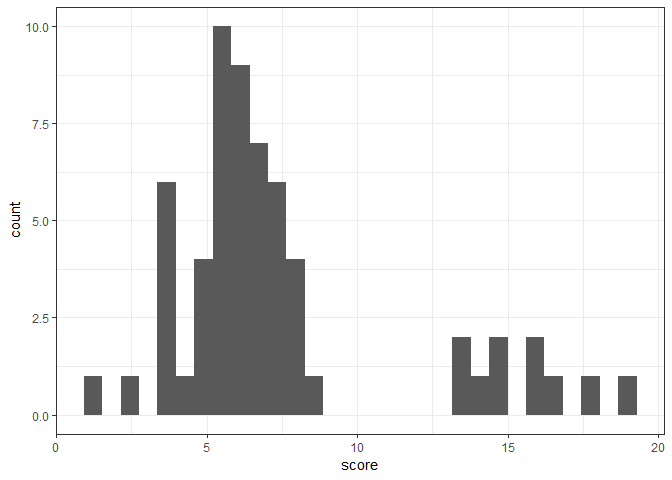
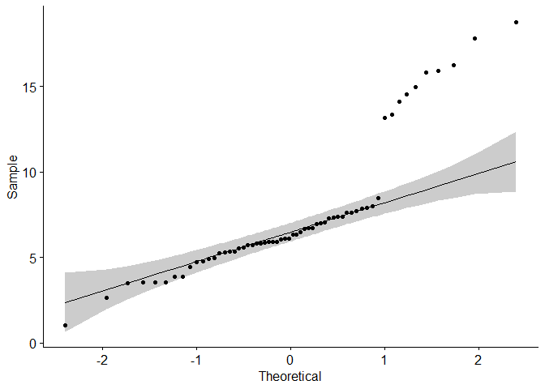
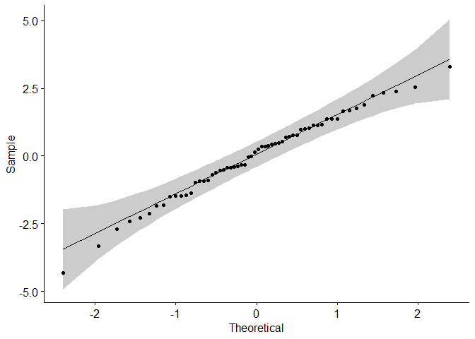
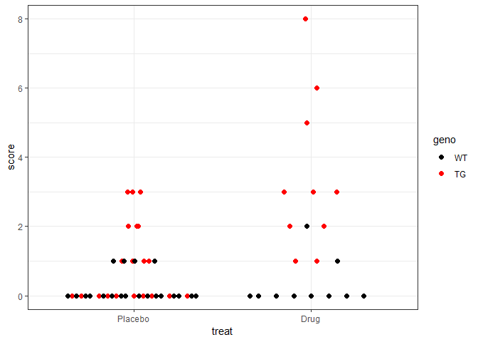
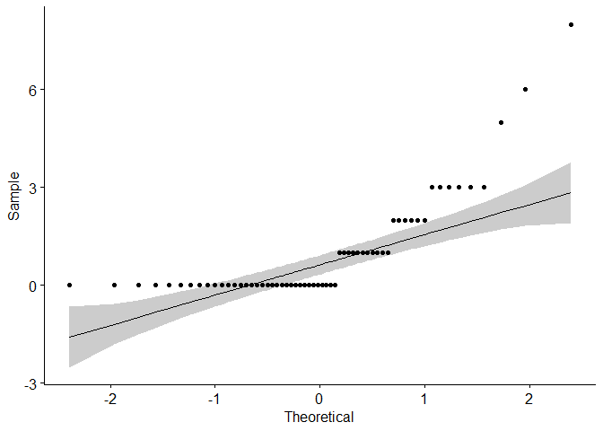
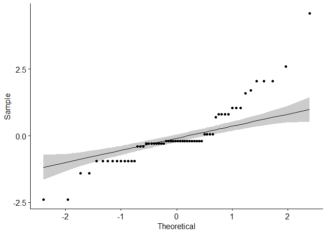
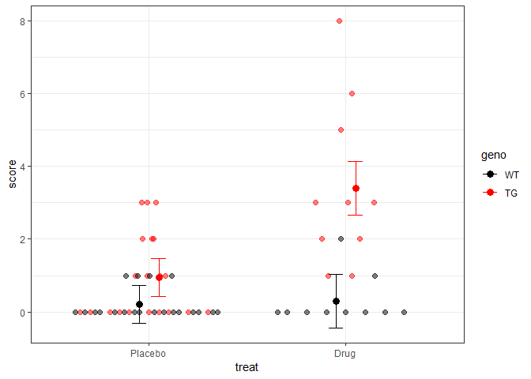
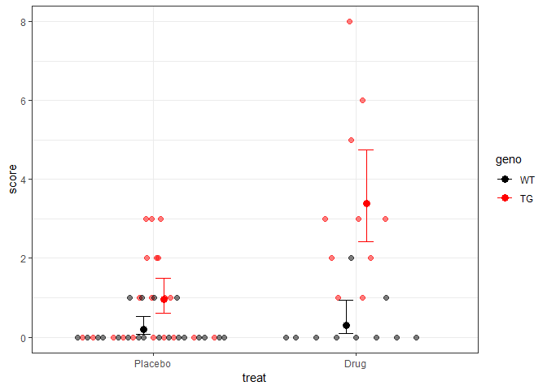

*3. Normality of Residuals*
================
Bindoff, A.
15 October 2018

Many statistical models make assumptions about the distribution of the
data, and p-values calculated from these models make the same
assumptions. Where model assumptions are violated, error rates will be
inflated. This is a poor use of resources, and leads to faulty inference
about the physical or biological processes you are trying to understand
by experimentation.

An assumption of many statistical models is that the *residuals* are
normally distributed. The residuals are the difference between the model
and the data. In mathematical notation,

\[Y = \beta_0 + \beta_1X_1 +\dots+\beta_kX_k + \epsilon\]
\[\epsilon \sim N(0, \sigma^2)\]

Note that there is no requirement that \(Y \sim N(0, \sigma^2)\), in
other words, the *data* do not need to be normally distributed.

Let’s learn how to assess the normality of residuals.

### Experimental data

We simulate data from a simple 2x2 between subjects experimental design.
Transgenic mice and wild-type controls were treated with either a Drug
or a Placebo then given a behavioural task which was scored. The drug
was very expensive so groups are unbalanced, 20 mice (10 x WT, 10 x TG)
received the drug and 40 mice (20 x WT, 20 x TG) received the placebo.
It was hypothesised that the drug would only have an effect on the TG
mice. The results are plotted using a beeswarm
plot.

<!-- -->

The beeswarm plot is a good choice for a small to medium N experiment
like this because it shows all of the data and the sampling distribution
at the two levels of treatment.

If we make the frequently used (but incorrect) assumption that the
*data* need to be normally distributed, we can plot the data using a
frequency histogram (a density plot would also be appropriate). This
shows a bi-modal
distribution.

<!-- -->

There are two types of people, those who like to dichotomise, and if you
are in this group you might like to use Shapiro-Wilk’s method to get a
p-value so that you can make a black and white decision about whether
these data are normally distributed or not -

``` r
shapiro.test(d$score)
```

    ## 
    ##  Shapiro-Wilk normality test
    ## 
    ## data:  d$score
    ## W = 0.81117, p-value = 2.593e-07

This p-value is definitely less than .05, so the data are not normally
distributed according to `shapiro.test`. My personal favourite approach
is to use a Q-Q plot, and the `ggpubr` library gives a very
interpretable example. The scores are plotted on the y-axis and the
theoretical quantiles are on the x-axis. If the data are normally
distributed with \(\mu = 0\) and SD = 1, the data-points should roughly
follow the diagonal line, staying within the confidence bands. This
approach satisfies both those who like to dichotomise and a multitude of
other personality
types.

``` r
ggqqplot(d$score)
```

<!-- -->

So by now you should be satisfied that the *data* are not normally
distributed (\(Y \not\sim N(0, \sigma^2)\)), but what about the
*residuals*? Are \(\epsilon \sim N(0, \sigma^2)\)? We fit a main effects
model and another model with the hypothesised main effects and
interaction and use `ggqqplot` to assess the normality of residuals.

``` r
model1 <- lm(score ~ treat + geno, d)
ggqqplot(resid(model1))
```

<!-- -->

``` r
model2 <- lm(score ~ treat + geno + treat:geno, d)
ggqqplot(resid(model2))
```

<!-- -->

We are satisfied that the residuals are approximately normally
distributed, and thus can interpret our p-values with some confidence.

    ## Analysis of Variance Table
    ## 
    ## Response: score
    ##            Df Sum Sq Mean Sq F value    Pr(>F)    
    ## treat       1 323.10  323.10 131.686 2.471e-16 ***
    ## geno        1 211.75  211.75  86.304 6.151e-13 ***
    ## treat:geno  1 247.24  247.24 100.770 3.978e-14 ***
    ## Residuals  56 137.40    2.45                      
    ## ---
    ## Signif. codes:  0 '***' 0.001 '**' 0.01 '*' 0.05 '.' 0.1 ' ' 1

### Central Limit Theorem

Central Limit Theorem (CLT) is a very important result in statistics. It
tells us that for a sufficiently large sample, the residuals will tend
to become normally distributed *regardless of the distribution of the
generating process*. For *independent* observations, “sufficiently
large” is around N = 30 according to some statistical texts. Given
that it’s relatively simple to check the normality of residuals, I
prefer not to mindlessly rely on CLT and the following example will
illustrate why.

### Definitely not normal

Data from a different experiment in the same study are now investigated.
The \(Y\) in this experiment are counts, and we can see immediately that
the counts are not normally distributed (in fact, they follow a Poisson
distribution).

<!-- -->
<!-- -->

We have simulated this data, so we know exactly what their distribution
is. For WT mice,  
\[Y_{WT} \sim Poisson(\lambda = 0.3)\]

And for TG mice,

\[Y_{TG_{placebo}} \sim Poisson(\lambda = .9)\]
\[Y_{TG_{drug}} \sim Poisson(\lambda = 4)\]

Despite this, because we have a large enough N, the *residuals* should
be approximately normally distributed. Fit the main effects +
interaction model and check with a Q-Q plot,

``` r
model2 <- lm(score ~ treat + geno + treat:geno, d)
ggqqplot(resid(model2))
```

<!-- -->

Uh-oh\!

Had our residuals been approximately normally distributed we could have
interpreted these p-values with more confidence.

    ## 
    ## Call:
    ## lm(formula = score ~ treat + geno + treat:geno, data = d)
    ## 
    ## Residuals:
    ##     Min      1Q  Median      3Q     Max 
    ## -2.4000 -0.4000 -0.2000  0.2125  4.6000 
    ## 
    ## Coefficients:
    ##                  Estimate Std. Error t value Pr(>|t|)    
    ## (Intercept)        0.2000     0.2650   0.755 0.453575    
    ## treatDrug          0.1000     0.4590   0.218 0.828322    
    ## genoTG             0.7500     0.3748   2.001 0.050218 .  
    ## treatDrug:genoTG   2.3500     0.6491   3.620 0.000634 ***
    ## ---
    ## Signif. codes:  0 '***' 0.001 '**' 0.01 '*' 0.05 '.' 0.1 ' ' 1
    ## 
    ## Residual standard error: 1.185 on 56 degrees of freedom
    ## Multiple R-squared:  0.4893, Adjusted R-squared:  0.4619 
    ## F-statistic: 17.88 on 3 and 56 DF,  p-value: 2.905e-08

Let’s plot the estimates and see what we
think

<!-- -->

Do these estimates look reasonable? How do you feel about the WT
confidence intervals?

Let’s see if we can improve our confidence intervals using a Generalized
Linear Model. Instead of assuming the residuals are normally
distributed, the GLM assumes they follow some other distribution which
can be modelled using a *link function*. The data are counts so we will
use a Poisson link function. A Poisson distribution has just one
parameter, \(\lambda\), which is a constant rate at which events will
occur. The Poisson distribution tells us the expected number of events
in a fixed interval of time (or space), given \(\lambda\). We wish to
estimate \(\lambda\) for each
condition.

``` r
model3 <- glm(score ~ treat + geno + treat:geno, d, family = "poisson")
```

<!-- -->

Both models arrive at the same point estimates, but the 95% CIs for the
GLM are clearly more sensible.
