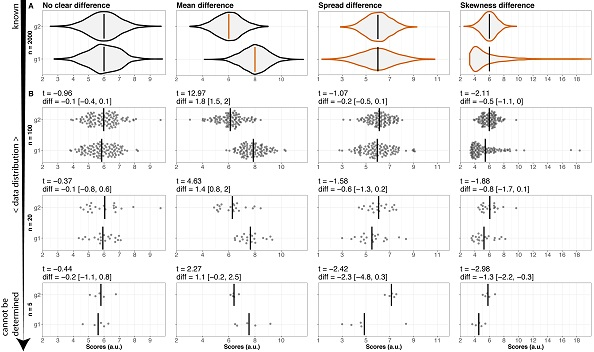

```{r setup, include=FALSE}
knitr::opts_chunk$set(echo = FALSE)
library(ggplot2)
```

## What is inference?

- descriptive statistics describes the sample (mean, standard deviation)
- inferential statistics infers properties of population
  - dependent on data
  - valid inference dependent on *how the data were collected and analysed*
  
## Why do we need p-values?

Consider the data from a single experiment on extra-sensory perception (Bem, 2011). Participants are shown a pair of curtains on a monitor and asked to guess which curtain the image is hidden behind. After the participant has made their selection, the computer decides at random whether there was an image behind the chosen curtain.  

Participants were able to guess which curtain would conceal the image 53.1% of the time.  

**What proportion of times would we expect participants to correctly guess which curtain concealed the image?**

## Why do we need p-values?

- p-values tell us how *surprising* the data would be if there was no underlying effect
- e.g imagine experiment where both groups receive the same placebo

$t(99) = 2.51, p = .01, d = 0.25$  

```{r}
# setting the seed for the random number generator
# assures reproducibility
set.seed(42)  
```

## Why do we need p-values?

If participants did not have ESP, what would the distribution of correct responses look like?  

First, let's simulate data for 100 participants who do **not** have ESP. There were 36 trials per participant in the Bem experiment.  

```{r, echo = TRUE}
# 36 trials with p = 0.5 chance of guessing correctly, n= 100 participants
bem <- function(n = 100){
  y <- replicate(n, rbinom(36, 1, prob = 0.5))
  colMeans(y)
}
y <- bem(n = 100)
```

## Proportion of correct responses per participant

```{r}
hist(y, main = "", breaks = seq(0.05, 1, by = 0.1))

```

## Mean correct responses per Bem replication

Replicate Bem 1000 times, plot distribution of results

```{r}
y <- replicate(1000, bem(n = 100))
replication <- colMeans(y)

par(mfrow = c(1, 2))
plot(ecdf(replication))
hist(replication)
```

## Do p-values completely solve the problem?

What is the distribution of p-values from our 1000 Bem replications?  

```{r, echo = FALSE}
pvals <- apply(y, 2, function(z) t.test(z-0.5)$p.val)

```

## Distribution of p-values (no effect)

```{r}
hist(pvals, breaks = 20, main = "")
```

## Type 1 error rate

We use $\alpha = .05$ by convention (or is it by convenience?)  

>>"It is convenient to take this point as a limit in judging whether a deviation is to be considered significant or not. Deviations exceeding twice the standard deviation are thus formally regarded as significant" (Fisher, 1925)  

Compare with the histogram on the previous slide, is this what you would expect?  

(Hold this thought, we will look at the distribution of p-values when there **is** an effect later)  

## Linear models

Let's build a data generation model!  

$y = \beta_0 + \beta_1x_1 + \epsilon$  
$\epsilon \sim N(0, \sigma^2)$

## Linear models

```{r, echo = TRUE}
set.seed(10)
B0 <- 3
B1 <- 1.5
epsilon <- function(){rnorm(12, mean = 0, sd = 1)}
x1 <- c(rep(0, 6), rep(1, 6))

y <- function(){B0 + B1*x1 + epsilon()}

```

## Linear models

```{r}
data <- data.frame(y = round(y(), 1), x1 = factor(x1))

ggplot(data = data, aes(y = y, x = x1)) +
  geom_boxplot()

```

## Linear models  

```{r}
data
```

## Linear models

```{r}
t.test(y ~ x1, data)
cat("\n\nDifference in group means = ", mean(data$y[7:12] - data$y[1:6]))

```

## Practical example - permutation test

Using the R scripts provided, generate data and write the numbers on the squares provided. On the coloured squares write the $y_i$ values corresponding to $x_{1_i} = 0$, and on the white paper write the $y_i$ values corresponding to $x_{1_i} = 1$.  

Now shuffle the squares and divide into two groups of 6.  

Calculate the difference between group means and record this number.  

Re-shuffle, divide into new groups and calculate the group mean differences 20 times.  

```{r}
shuffle <- function(y){
  n <- length(y)
  ydot <- sample(y, n, replace = FALSE)
  y1 <- ydot[1:floor(n/2)]
  y2 <- ydot[(floor(n/2)+1):n]
  abs(mean(y1)-mean(y2))
}
set.seed(1)
permute <- replicate(100, shuffle(data$y), simplify = "array")
```

## Practical example - permutation test

Out of 100 permutations, how many resulted in a difference at least as large as observed in our experiment?  

```{r}
hist(permute, breaks = 20, xlab = "random group diff", main = "Null distribution")

```

## Distribution of p-values (large effect)

```{r, echo = TRUE}
p.val.perm <- function(){
  k <- y()         # run experiment again (random draws from generating model)
  obs.diff <- abs(mean(k[7:12]-k[1:6]))  # calculate observed difference of means
  perm <- replicate(100, shuffle(k))     # permute ("shuffle") 100 times and calculate observed differences
  mean(perm >= obs.diff)       # what proportion of permutations >= observed difference from experiment
}

p.perm <- replicate(500, p.val.perm())   # repeat experiment 500 times, storing p-value each time
mean(p.perm < .05)                       # true positive rate by permutation test
```

## Distribution of p-values (large effect)


```{r}

hist(p.perm, breaks = 20)
```

## What have we learned?

- $\alpha$ (typically $\alpha = .05$) is the proportion of times we're prepared to reject the null when it is true, the so-called Type 1 error rate
- if there is no difference between groups p-values are uniformly distributed over many experiments (p = .001 is no more unusual than p = .321)
- if there is a difference between groups, p-values will not be uniformly distributed over many experiments (this is why p-values are useful under the "frequentist" assumptions)


## What have we learned?

- $\alpha$ (typically $\alpha = .05$) is the proportion of times we're prepared to reject the null when it is true, the so-called Type 1 error rate
- if there is no difference between groups p-values are uniformly distributed over many experiments (p = .001 is no more unusual than p = .321)
- if there is a difference between groups, p-values will not be uniformly distributed over many experiments (this is why p-values are useful under the "frequentist" assumptions)
- the p-value tells us how surprising the data would be if there were no effect

## What have we learned?

- the p-value can't tell us if there is no effect (it can tell us if the **data** would not be surprising under the null) 
- $p(y|H_0) \neq p(H_0|y)$ "fallacy of the transposed conditional"  

## What have we learned?

- the p-value can't tell us if there is no effect (it can tell us if the **data** would not be surprising under the null) 
- $p(y|H_0) \neq p(H_0|y)$ "fallacy of the transposed conditional"  
- the p-value is heavily dependent on test assumptions - **you must check that these assumptions are satisfied**

## What have we learned?

- the p-value can't tell us if there is no effect (it can tell us if the **data** would not be surprising under the null) 
- $p(y|H_0) \neq p(H_0|y)$ "fallacy of the transposed conditional"  
- the p-value is heavily dependent on test assumptions - **you must check that these assumptions are satisfied**
  - Google
  - consult a friendly statistician
  
## What have we learned?



Fig courtesy of Rousselet, G. A., Pernet, C. R., Wilcox, R. R. (2017)
"Beyond differences in means: robust graphical methods to compare two groups in neuroscience"

## References

Bem, D. J. (2011). Feeling the future: experimental evidence for anomalous retroactive influences on cognition and affect. Journal of personality and social psychology, 100(3), 407.  

https://slate.com/health-and-science/2017/06/daryl-bem-proved-esp-is-real-showed-science-is-broken.html  

https://rationalwiki.org/wiki/Confusion_of_the_inverse ("fallacy of the transposed conditional")  

Rousselet, G. A., Pernet, C. R., & Wilcox, R. R. (2017). Beyond differences in means: robust graphical methods to compare two groups in neuroscience. European Journal of Neuroscience, 46(2), 1738-1748.  

